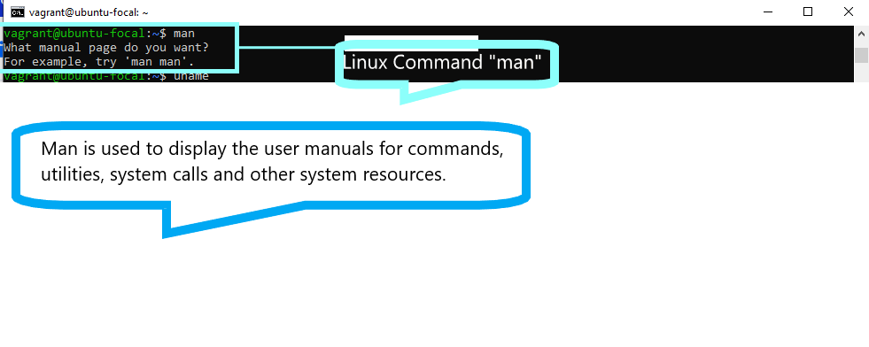
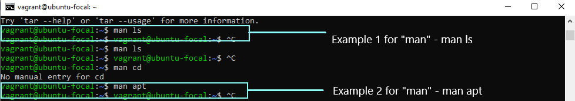
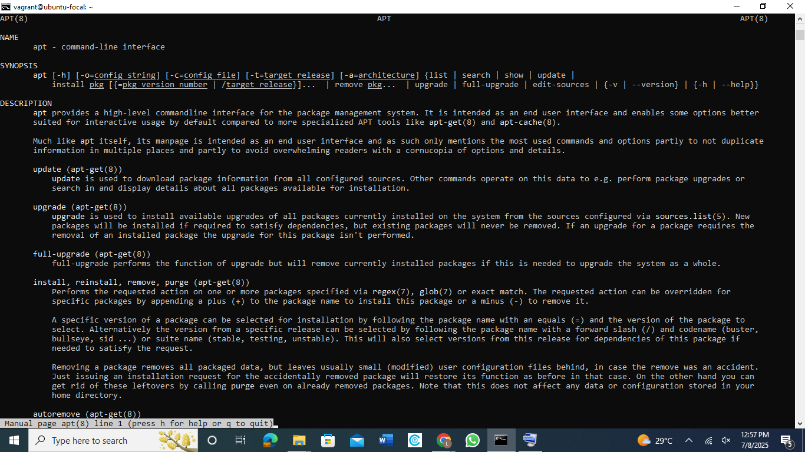
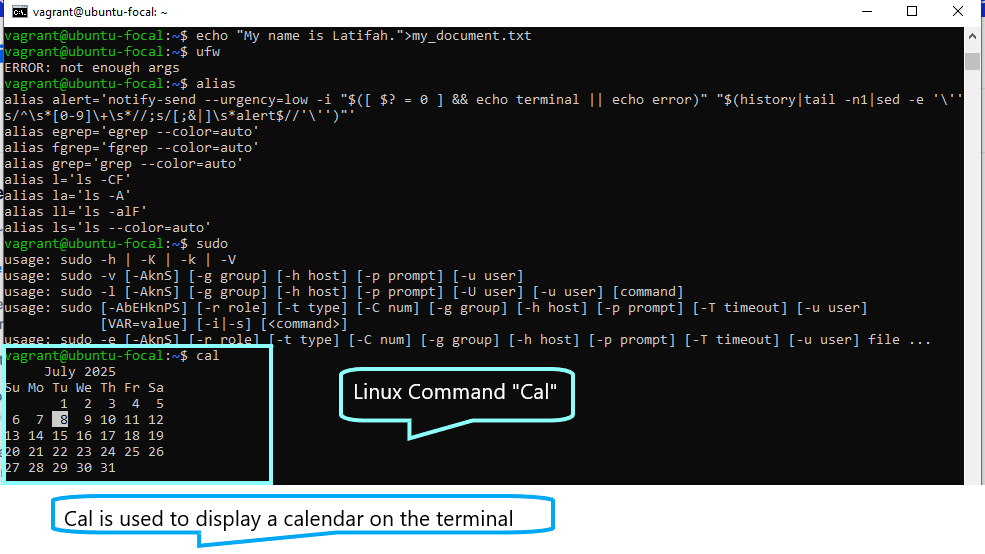
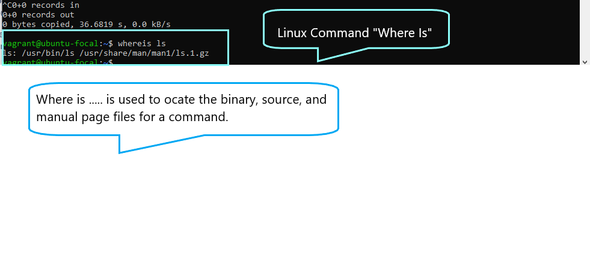
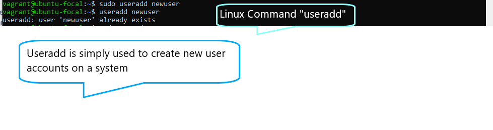
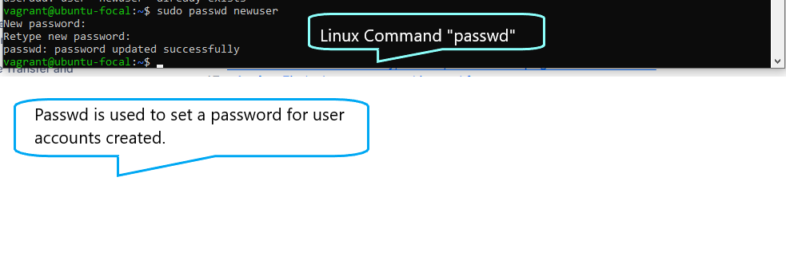
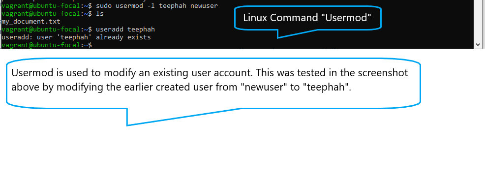
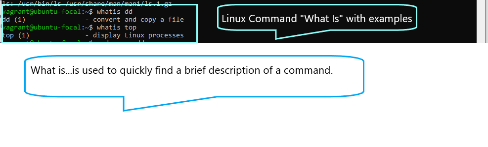
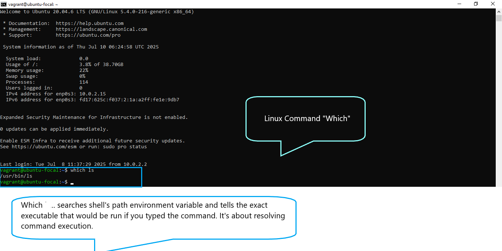

# 10 Linux Commands

# Linux Command 1 - `man`

# Linux Command 1 Examples

# Output for `man ls`

# Output for `man apt`

# Linux Command 2 - `Alias`

# Linux Command 3 - `Sudo`

# Linux Command 4 - `Cal`

# Linux Command 5 - `Where Is`

# Linux Command 6 - `Useradd`

# Linux Command 7 - `Passwd`

# Linux Command 8 - `Usermod`

# Linux Command 9 - `What Is`

# Linux Command 10 - `Which`
