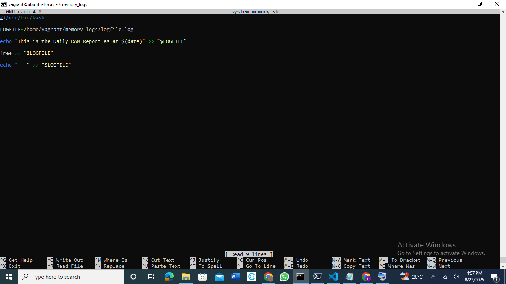
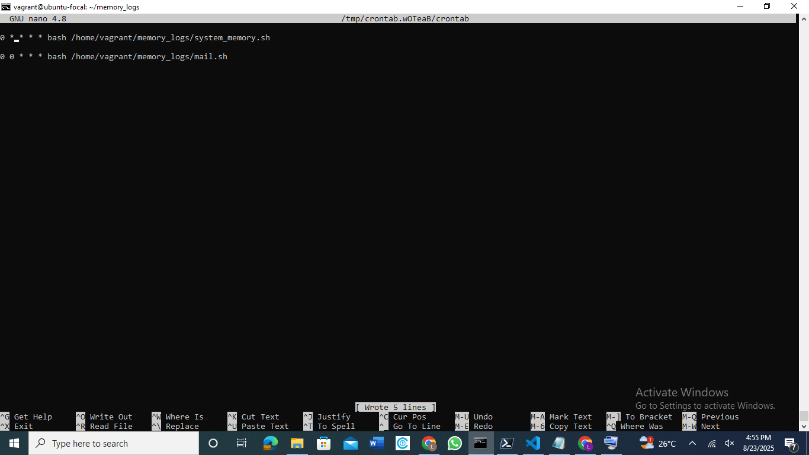
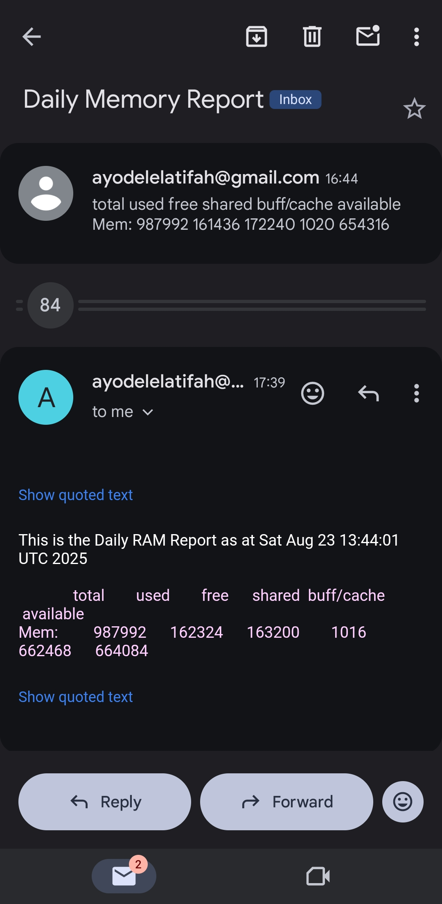

# The snapshot below shows the content of my script

# The snapshot below shows the content of my cronjobs

# The snapshot below shows the content of email i received as instructed by the cronjob
